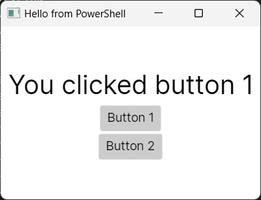

# Powershell-Avalonia-Sample
Sample on how to create an Avalonia 11 UI directly from powershell. To run this script successfully you must place it in a folder containing all the avalonia assemblies (should also include the 'runtimes' folder). In addition to that, copy libHarfBuzzSharp.dll and libSkiaSharp.dll from runtimes/win-x64/native to the same location as the script. For reference, here's the complete content of my working sample:

    runtimes (folder)
    avalonia_demo.ps1
    Avalonia.Base.dll
    Avalonia.Controls.dll
    Avalonia.DesignerSupport.dll
    Avalonia.Desktop.dll
    Avalonia.Dialogs.dll
    Avalonia.dll
    Avalonia.FreeDesktop.dll
    Avalonia.Markup.dll
    Avalonia.Markup.Xaml.dll
    Avalonia.MicroCom.dll
    Avalonia.Native.dll
    Avalonia.OpenGL.dll
    Avalonia.Remote.Protocol.dll
    Avalonia.Skia.dll
    Avalonia.Themes.Fluent.dll
    Avalonia.Win32.dll
    Avalonia.X11.dll
    HarfBuzzSharp.dll
    JetBrains.Annotations.dll
    libHarfBuzzSharp.dll
    libSkiaSharp.dll
    MicroCom.Runtime.dll
    Microsoft.Win32.SystemEvents.dll
    MinimalAvalonia.Sample.dll
    SkiaSharp.dll
    System.Drawing.Common.dll
    System.Reactive.dll
    Tmds.DBus.dll

# Screenshot

